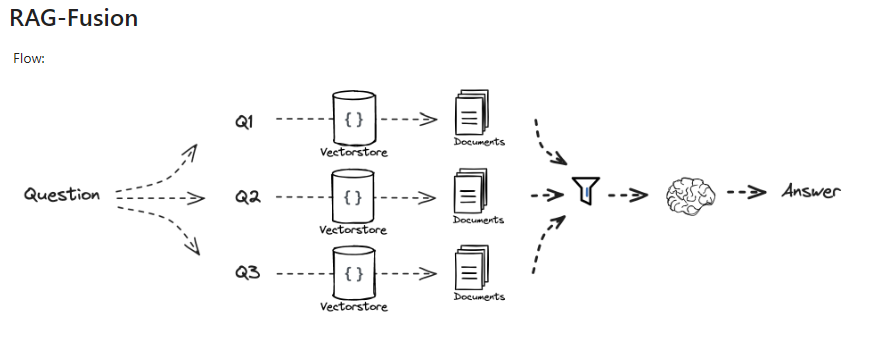

# GEN AI Application development

# Projects Overview

Projects demonstrates various integrations with Large Language Models (LLMs) using the SemanticKernel (gen-ai-dev-sk) and LangChain4J (gen-ai-dev-lc) Java frameworks. 
Each project is divided into the following modules:

## Modules

### 1. Chatbot with Chat Memory
- **Source Code:**
    - Functionality: `service/chat`, `service/prompt`
    - Test Client: `test/*/ChatApiClient`
- **Description:**
  This module showcases integration with general-purpose LLMs like GPT-4, utilizing chat memory to maintain conversation context. This allows the chatbot to emulate a coherent and continuous conversation.

### 2. Embeddings / Similarity Search
- **Source Code:**
    - Functionality: `service/similarity`
    - Test Client: `test/*/SimilarityApiClient`
- **Description:**
  This module demonstrates how to generate embeddings (vector representations) for provided words or phrases and perform contextual similarity searches. The system can find sentences similar to a user-provided question.

### 3. Function Execution
- **Source Code:**
    - Functionality: `service/prompt/lc/tool`, `service/prompt/sk/plugin`
    - Test Client: `test/*/ChatApiClient`
- **Description:**
  This module illustrates how LLMs can execute functions by invoking available tools, which can range from web searches to external API calls or specific code executions. A simple chatbot for an Italian pizzeria was implemented to demonstrate this functionality. LangChain4J is highlighted for its stability and robustness compared to SemanticKernel.

### 4. Retrieval-Augmented Generation (RAG)
- **Source Code:**
    - Functionality: `service/rag`
    - Test Client: `test/*/RAGApiClient`

- **Description:**
  This module explores different approaches to Retrieval-Augmented Generation (RAG). The implementation includes:
    - Document indexing using LangChain4J document parser and splitter.
    - Vector storage via Qdrant.
    - RAG-Fusion approach.
    - Framework: SemanticKernel.

  LangChain4J was not used extensively here due to its comprehensive pre-built implementations, which simplify the process but are less educational. SemanticKernel, requiring more custom development, offers a deeper understanding of underlying mechanics.

## Key Points
- **Chatbot with Chat Memory:** Uses GPT-4 and chat memory for contextual conversations.
- **Embeddings / Similarity Search:** Generates embeddings and performs similarity searches.
- **Function Execution:** Enables LLMs to call external tools, demonstrated with an Italian pizzeria chatbot.
- **RAG:** Employs RAG-Fusion with SemanticKernel for document indexing and vector storage, offering educational insights into the process.

## Framework Comparisons
- **LangChain4J:** Stable, robust, with comprehensive pre-built features.
- **SemanticKernel:** Requires more custom implementation, providing better educational value and understanding of internal workings.

## Conclusion
This project serves as a comprehensive guide to integrating LLMs with Java frameworks, offering practical examples across different functionalities including chat memory, similarity search, function execution, and RAG.

## Resources

### Introduction into Gen AI

- [Intro to Large Language Models](https://www.youtube.com/watch?v=zjkBMFhNj_g)
- [How GPT models work: accessible to everyone](https://bea.stollnitz.com/blog/how-gpt-works/)
- [SemanticKernel documentation](https://learn.microsoft.com/en-us/semantic-kernel/overview/)
- [LangChain4j documentation](https://docs.langchain4j.dev/intro)

### Prompt engineering

- [ChatGPT Prompt Engineering for Developers](https://learn.deeplearning.ai/courses/chatgpt-prompt-eng)

### Function (tools) execution

- [The Definitive Guide to Tool Support in LangChain4J](https://www.youtube.com/watch?v=cjI_6Siry-s)

### Embeddings

- [An intuitive introduction to text embeddings](https://stackoverflow.blog/2023/11/09/an-intuitive-introduction-to-text-embeddings/)
- [Transformers (how LLMs work) explained visually](https://www.youtube.com/watch?v=wjZofJX0v4M&t=747s)
- [Video1: The attention mechanism in high level](https://www.youtube.com/watch?v=OxCpWwDCDFQ)
- [Video 2: The attention mechanism with math](https://www.youtube.com/watch?v=UPtG_38Oq8o)
- [Video3: Transformer models](https://www.youtube.com/watch?v=qaWMOYf4ri8&t=1152s)

### Vector DB
 
- [Vector database vs. graph database](https://www.elastic.co/blog/vector-database-vs-graph-database)

### RAG

- [RAG from scratch](https://www.youtube.com/playlist?list=PLfaIDFEXuae2LXbO1_PKyVJiQ23ZztA0x)
- [Building RAG apps with Java and Semantic Kernel](https://www.youtube.com/watch?v=QoLWHZQD6R8) 